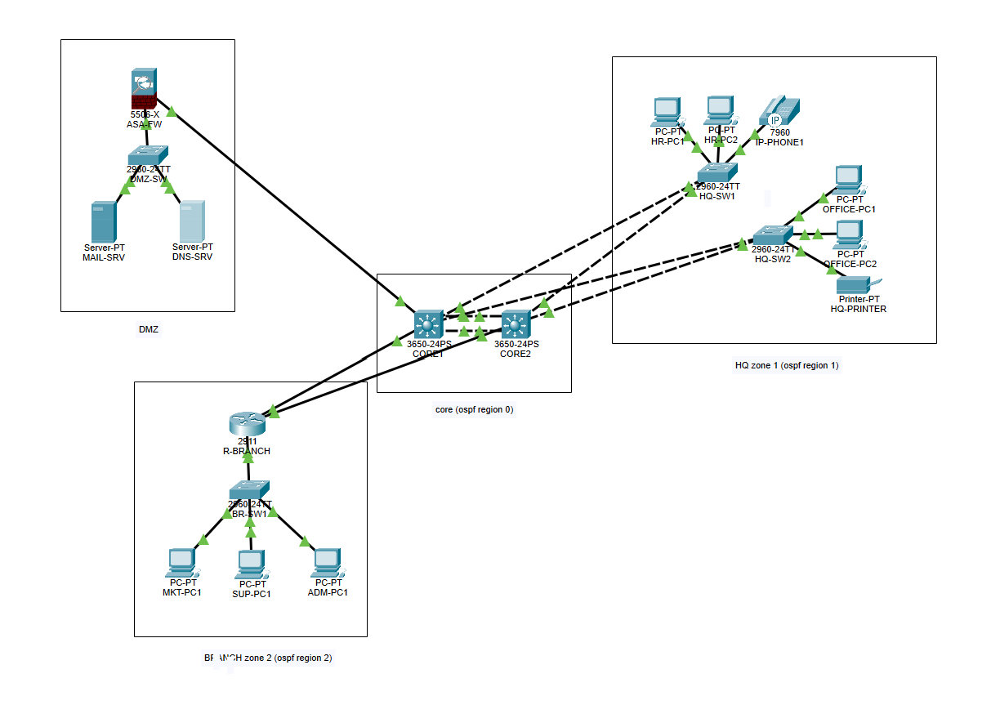
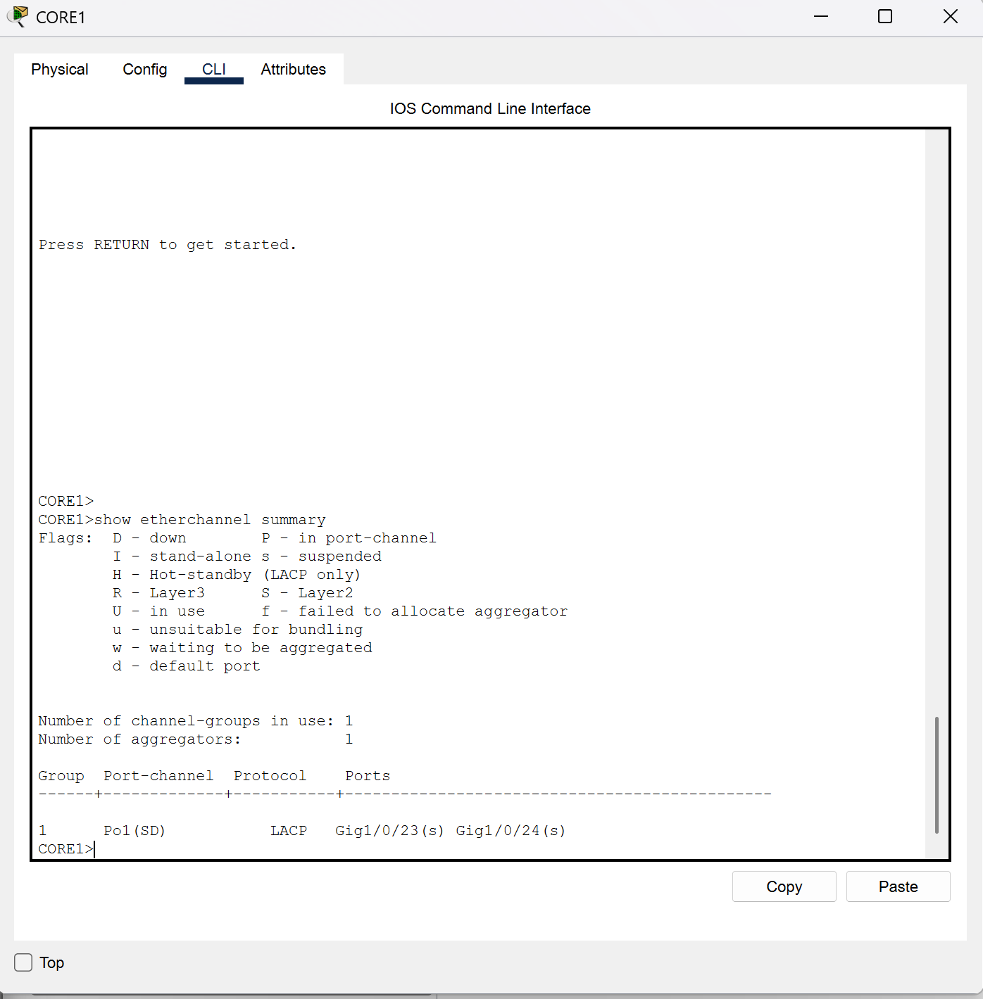
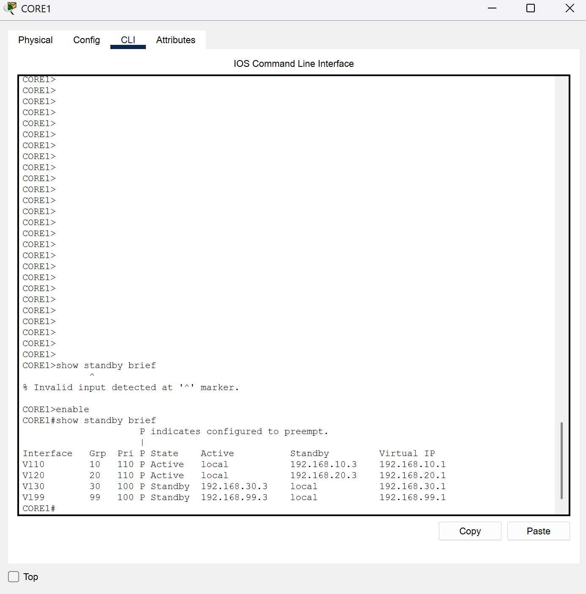
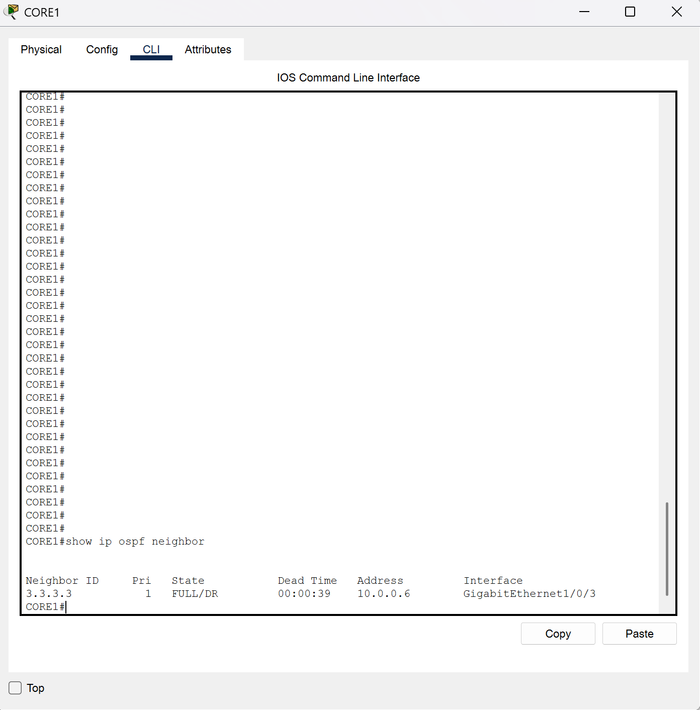
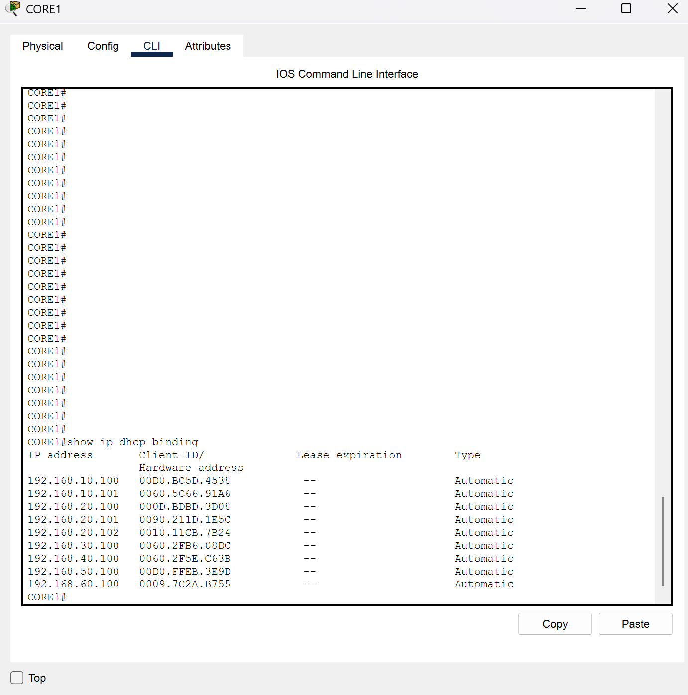
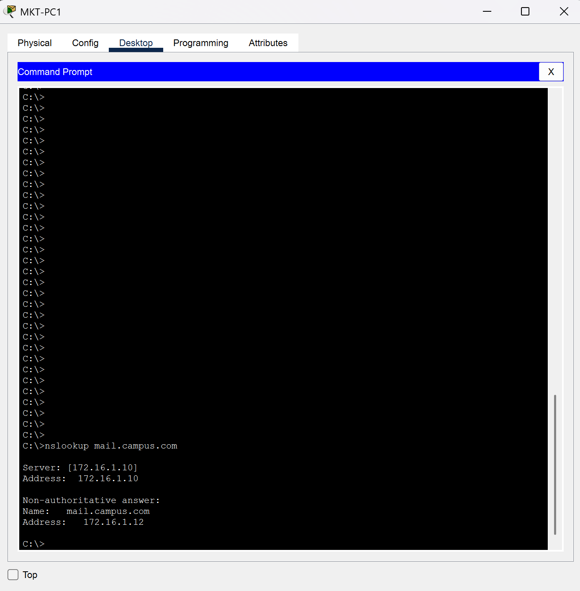
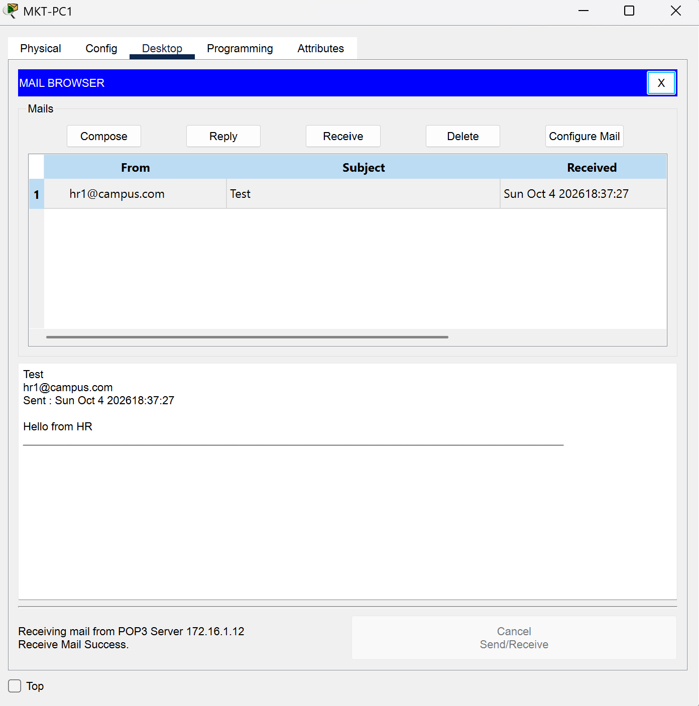
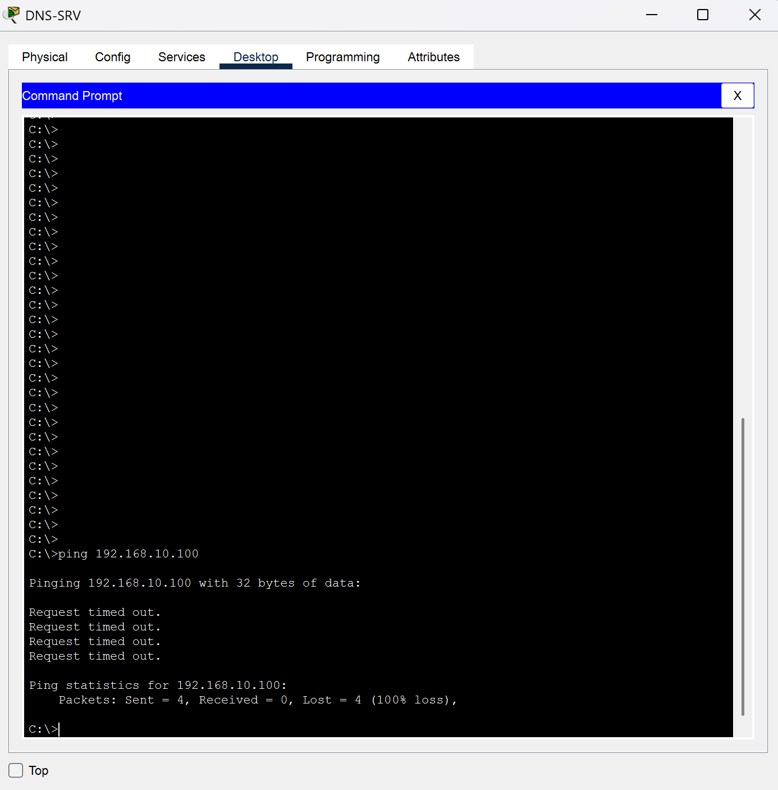

# 🌐 Secured Enterprise Campus Network

A multi-zone enterprise campus network built and tested in **Cisco Packet Tracer 9.0**, based on my CCNA final project. It covers redundant core switching, dynamic routing across three OSPF areas, a firewalled DMZ, and centralized network services, with security hardening applied throughout.

*Individual project — designed, configured, and troubleshot by me.*

## Network Zones
| Zone | Purpose | Key Devices |
|---|---|---|
| Core (OSPF Area 0) | Redundant Layer 3 backbone | 2 × Cisco 3650 multilayer switches |
| HQ – Zone 1 (OSPF Area 1) | HR, office, voice, and management users | 2 × Cisco 2960, PCs, IP phone, printer |
| Branch – Zone 2 (OSPF Area 2) | Marketing, support, and admin users | Cisco 2911 router, Cisco 2960, PCs |
| DMZ | Public-facing services, isolated by a firewall | Cisco ASA 5506-X, Cisco 2960, DNS and mail servers |

## Addressing Plan
| Network | VLAN | Subnet | Gateway |
|---|---|---|---|
| HQ – HR | 10 | 192.168.10.0/24 | 192.168.10.1 (HSRP) |
| HQ – Office | 20 | 192.168.20.0/24 | 192.168.20.1 (HSRP) |
| HQ – Voice | 30 | 192.168.30.0/24 | 192.168.30.1 (HSRP) |
| HQ – Management | 99 | 192.168.99.0/24 | 192.168.99.1 (HSRP) |
| Branch – Marketing | 40 | 192.168.40.0/24 | 192.168.40.1 |
| Branch – Support | 50 | 192.168.50.0/24 | 192.168.50.1 |
| Branch – Admin | 60 | 192.168.60.0/24 | 192.168.60.1 |
| Core transit | 900 | 10.0.0.16/30 | — |
| DMZ servers | 100 | 172.16.1.0/24 | 172.16.1.1 (ASA) |
| Point-to-point links | — | 10.0.0.4/30, 10.0.0.8/30, 10.0.0.12/30 | — |

## What I Configured

**Switching**
- VLAN segmentation by department and function, with a dedicated voice VLAN
- 802.1Q trunks with an unused native VLAN (999)
- LACP EtherChannel bundling the two core-to-core links
- Rapid PVST+ with root bridges aligned to the HSRP active gateways for load balancing

**Routing and Redundancy**
- Inter-VLAN routing on the core switches using SVIs
- HSRP gateway redundancy, with CORE1 active for VLANs 10/20 and CORE2 for 30/99
- Dual-homed access switches and a dual-homed branch router
- Multi-area OSPF: Area 0 backbone, Area 1 (HQ), Area 2 (branch), with the core switches and branch router as ABRs
- Router-on-a-stick at the branch
- Static route to the DMZ redistributed into OSPF

**Security**
- Cisco ASA with security zones: inside (level 100) and DMZ (level 50)
- Least-privilege firewall rules: internal users can reach only DNS on the DNS server and SMTP/POP3 on the mail server
- The DMZ cannot initiate connections into the internal network
- Unused switch ports shut down
- OSPF passive interfaces on user-facing networks
- Server hardening: only the required service enabled on each server
- Enable password set on the firewall

**Services**
- Centralized DHCP on CORE1, with DHCP relay from CORE2 and the branch router
- DNS server resolving internal names (campus.com)
- Mail server (SMTP/POP3) used for end-to-end testing

## Verification
| Test | Result |
|---|---|
| EtherChannel | Po1 up and bundled (SU), both members in the channel |
| HSRP | CORE1 active for VLANs 10/20, standby for 30/99 |
| OSPF | Full adjacencies with CORE2 (via VLAN 900) and R-BRANCH |
| DHCP | Clients in every VLAN receive addresses from the correct pool |
| DNS | Branch PC resolves mail.campus.com through the firewall |
| Email | Mail sent from HQ received at the branch |
| Firewall | DMZ server's ping into the HR VLAN is blocked |

### EtherChannel

### HSRP

### OSPF Neighbors

### DHCP Bindings

### DNS Resolution Through the Firewall

### End-to-End Email

### Firewall Blocking the DMZ

## Troubleshooting Log
Problems I hit during the build, and how I solved them:

- **Firewall not answering pings from the core:** the inside access list was also filtering traffic addressed to the ASA itself. I isolated it by temporarily removing the access list, then added a rule permitting ICMP to the inside interface.
- **Pings through the firewall failing:** using Packet Tracer's simulation mode, I traced the packet and found requests reached the DMZ server but replies were dropped at the ASA. Packet Tracer's ASA does not fully track ICMP state, so I added a DMZ rule permitting only echo-replies, which keeps the DMZ unable to start connections inward.
- **DNS lookups timing out:** the same reply-path behavior affected DNS. I permitted only replies sourced from the DNS and mail service ports.
- **DHCP server pools could not be created:** a bug in Packet Tracer 9.0's server interface blocked new pools, so I redesigned DHCP as a centralized service on CORE1 with relay from CORE2 and the branch.
- **OSPF adjacency missing between the cores:** the transit VLAN was allowed on the port-channel but not on its member ports. Adding it to both fixed the adjacency.

## Known Limitations
- The DMZ connects through CORE1 only, so a CORE1 failure would isolate the DMZ. A production design would add a second firewall link or a failover firewall pair.
- DHCP depends on CORE1. Existing clients keep their leases if it fails, but new clients cannot obtain addresses.
- The reply-path firewall rules work around Packet Tracer's ASA behavior. On real hardware, stateful inspection would handle return traffic without them.

## Files
- `Enterprise_Campus_Network.pkt` — the Packet Tracer project
- `*.txt` — configuration scripts for each network device (the exact commands applied, passwords removed)
- `*.png` — topology and verification screenshots

## Tools
Cisco Packet Tracer 9.0
